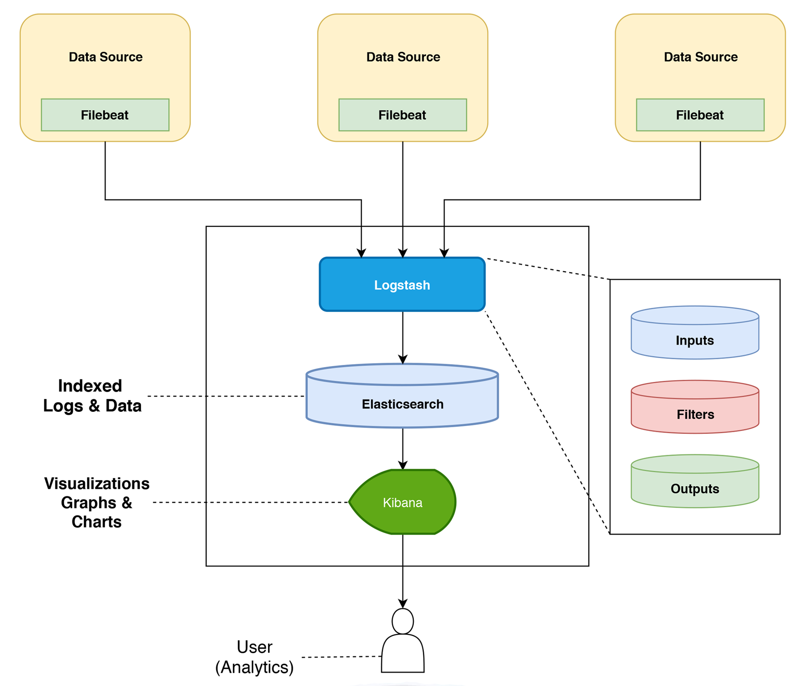

# ft_transcendence_elk_stack

The ELK Stack (Elasticsearch, Logstash, and Kibana)

How to run:
docker compose up -d

Kibana needs several minutes to be reachable.

then go to: https://localhost:5601
login wiht:
login: elastic
password: 1_Kibana

Go to dashboard -> FTT Logs Overview

Logstash collects, enrich and filter data (inputs -> filters -> outputs)
Elasticsearch indexes and stores the data
Kibana consumes the data - visualize - dashboards, lenses, analytics, etc.

INTEGRATE WITH FT_TRANSCENDENCE APP:

<b>Fastify has to log to shared volume on containers network /logs/ft_transcendence.json (now here logs the loggen-json.py script)</b>

App writes JSONL to /logs/ft_transcendence.json.
Ensure both the app container and logstash mount the same volume at /logs.
Logstash file input tails it.
Tips:
Write one compact JSON per line + newline.
Include an ISO8601 timestamp if you want exact event times; otherwise Logstash will use ingest time.
Rotate files if they get big (copytruncate or logrotate) — Logstash can handle rotation when configured with file_completed_action or by re-reading new files that match the pattern.

DATA FLOW:
[loggen-json.py]  --->  [shared volume /logs]  --->  [Logstash]
 (writes JSONL)           (a file everyone            |  parses JSON
                           can see)                   |  adds/renames fields
                                                     v
                                                  [Elasticsearch]
                                                     |
                                                     v
                                                   [Kibana]
                                            (data view + Lens)

loggen-json.py writes one JSON object per line (JSONL) into a file, e.g. /logs/ft_transcendence.json.
That file lives on a Docker volume that is mounted into both the generator/app container and the Logstash container.
Logstash uses a file input to tail that file, decodes each line as JSON, does lightweight filtering/normalization, and sends documents to Elasticsearch.
Elasticsearch stores them in indices controlled by a template/ILM and exposes an alias (e.g. ftt-logs-json) that Kibana queries.
Kibana has a Data View (ftt-logs) that points at that alias and your Lens visualizations query that data view.
/logs is not just a folder inside one container; it’s a shared volume from your docker-compose that is mounted:
into the generator/app container at /logs
into the logstash container at the same /logs
That’s how Logstash “sees” the file your script is writing.
Output (ships to Elasticsearch)
elasticsearch { hosts => ["https://elasticsearch:9200"] … index => "ftt-logs-json-000001" ... }
Usually paired with an index template + ILM so new backing indices roll over and are all pointed to by an alias like ftt-logs-json.

How does Elasticsearch expose it to Kibana?
Your index template/ILM manages indices like ftt-logs-json-000001, 000002, …
An alias (e.g., ftt-logs-json) always points to the current write index.
In Kibana you created a Data View named FTT Logs with id ftt-logs and title ftt-logs-json* (so it matches the alias/backing indices).
Your Lens panels are wired to that data view id; when you open the dashboard, Kibana queries via that alias, not hardcoded index names.
